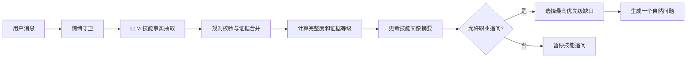

# 技能证据链与自动追问

## 功能目标

技能画像不再依赖“掌握度 80%”一类难以解释的分数，而是通过用户真实经历回答三个问题：用户会什么、有什么事实能够证明、距离目标岗位还缺什么。

系统将技能摘要、具体证据和待回答问题分层保存。同一个技能可以关联多条项目或工作证据，后续回答会合并回原证据，不会覆盖历史内容或重复创建技能。

## 数据结构

`skill_evidence` 保存技能画像摘要，用于左侧列表和岗位匹配：

- 技能名称、分类和当前状态
- 最有代表性的证据摘要
- 岗位要求与下一步建议

`skill_evidence_items` 保存完整证据链：

- 使用场景 `scenario`
- 承担任务 `task`
- 具体行动 `action`
- 实际结果 `result`
- 量化数据 `metric`
- 用户角色 `user_role`
- 使用时间 `used_at`
- 原始文本、来源和抽取可信度

`skill_follow_ups` 保存当前待回答问题，并通过 `evidence_id` 指向需要补全的证据。

## 处理流程

LLM 只负责从自然语言中提取事实，不负责决定技能等级。等级和完整度由后端确定性规则计算，以避免模型随意给分或夸大用户能力。LLM 不可用时，系统使用关键词和表达模式完成基础提取。

## 证据等级

- `mentioned`：只提到技能，或证据字段不足。
- `used`：至少包含场景、行动、结果中的两个字段。
- `proven`：场景、行动和结果完整。
- `strong`：完整证据之外，还有量化结果和个人角色。

完整度按必需字段和补充字段计算。技能摘要只有在证据达到 `proven` 或 `strong` 后才会标记为“已证明”。

## 自动追问策略

缺口优先级为：结果、行动、场景、量化数据、个人角色。系统每轮只选择一个问题，例如：

> 做完之后带来了什么变化？没有精确数字，说大致效果也可以。

用户回答后，系统读取当前 `pending` 追问，将回答合并到对应证据，再计算下一个缺口。同一证据连续追问达到限制后会暂停，避免对话变成问卷。当技能追问存在时，系统会去除普通回复里的其他问题，并暂停简历模块的额外追问。

情绪守卫拥有更高优先级。进入心理疏导模式后，技能信息仍可被安全记录，但不会创建或输出职业追问。

## 前端表现

左侧技能评估继续展示“已证明、提到但缺证据、岗位缺口”摘要。右侧技能工作区展示每条证据的场景、行动、结果、量化数据、个人角色、证据等级和完整度。

“在对话中补充”按钮会把建议问题带入聊天输入框，由用户决定是否继续回答，不会自动发送消息。

## 验证

自动化测试覆盖：

- 多轮回答合并到同一条证据。
- 证据从不完整逐步升级为强证据。
- 技能摘要同步升级为“已证明”。
- 情绪干预期间不产生技能追问。
- 前端 TypeScript 编译和生产构建。
