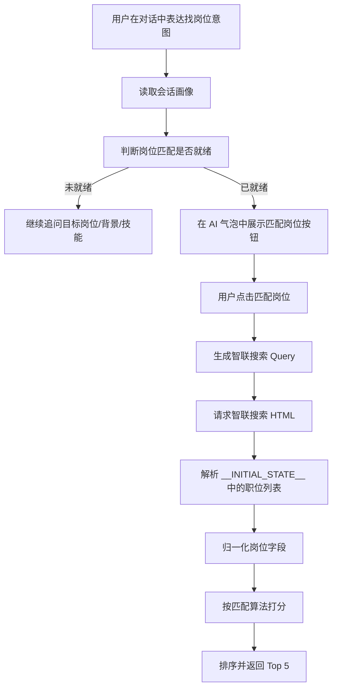

# OpenCareer 岗位匹配算法说明

## 1. 目标

岗位匹配模块的目标不是简单做关键词搜索，而是根据当前会话中已经沉淀出的用户画像，实时从智联招聘搜索页获取岗位，再按用户的求职目标、技能画像、城市、实习/全职意向等因素进行排序，最后返回最适合展示给用户的 5 个真实岗位。

当前实现对应三个核心文件：

- `web/backend/services/job_search_readiness.py`
- `web/backend/services/zhaopin_job_service.py`
- `web/backend/api/routes/job_search.py`

前端按钮渲染和结果展示在：

- `web/front/src/components/MessageList.tsx`

## 2. 整体流程



## 3. 画像准备与就绪判断

`evaluate_job_search_readiness(session_id)` 会从三类数据中提取匹配所需信息：

1. 简历采集状态  
   通过 `ResumeBuilderService().load_state(session_id)` 读取用户当前简历画像，包括目标岗位、城市、薪资、专业、学历、项目经历等。

2. 技能证据链  
   通过 `list_skill_evidence(session_id)` 读取用户已经提到或已证明的技能，例如 Java、Spring Boot、MySQL。

3. 历史对话  
   通过 `get_messages(session_id)` 读取用户最近对话，用于判断用户是否明确表达了找岗位意图。

当前最小就绪条件是：

- 有目标岗位，例如 `Java 后端实习`
- 有基础背景，例如学校、专业、年级、教育经历或项目经历
- 有技能信息，来自技能证据链或简历状态

只有同时满足“信息足够”和“用户明确表达找岗位/匹配岗位意图”时，系统才会在 AI 气泡中返回：

```json
{
  "action": "start_job_matching",
  "label": "匹配岗位",
  "query_plan": {}
}
```

前端据此展示“匹配岗位”按钮。

## 4. 查询计划 Query Plan

就绪后，系统会生成一个 `query_plan`，作为后续搜索和打分的统一输入。

典型结构如下：

```json
{
  "role": "Java 后端实习",
  "city": "南京",
  "city_code": "635",
  "salary": "面议",
  "skills": ["Java", "Spring Boot", "MySQL", "Redis"],
  "employment_type": "实习",
  "major": "软件工程",
  "industry": "互联网"
}
```

城市代码维护在 `CITY_CODES` 中。目前覆盖全国、北京、上海、广州、深圳、杭州、成都、南京、武汉、西安、苏州等常见城市。

如果用户没有明确城市，默认使用全国。

## 5. 智联搜索 URL 生成

当前使用的是智联招聘服务端渲染搜索页，而不是旧版 JSON API。

URL 形态：

```text
https://www.zhaopin.com/sou/jl{城市代码}/kw{关键词编码}/p{页码}
```

其中关键词不是普通 URL 编码，而是智联页面使用的一种 base32 风格编码。

实现函数：

```python
encode_zhaopin_keyword(keyword: str) -> str
build_zhaopin_search_url(city_code: str, keyword: str, page: int = 1) -> str
```

编码逻辑：

1. 将关键词按 `utf-16-be` 编码为字节
2. 转成二进制 bit 串
3. 按 5 bit 一组切分
4. 映射到字符表 `0123456789ABCDEFGHIJKLMNOPQRSTUV`

例如用户目标是 `Java 后端实习`，南京城市代码是 `635`，系统会构造类似：

```text
https://www.zhaopin.com/sou/jl635/kw{encoded}/p1
```

## 6. 搜索 Query 扩展策略

`build_search_queries(plan)` 会从用户目标和技能中构造最多 3 个搜索词，避免只搜一个词导致召回不足。

当前策略：

1. 主搜索词  
   使用目标岗位加实习/全职类型，例如：

   ```text
   Java 后端实习
   ```

2. 技术语言扩展  
   如果目标或技能中包含 Java、Python、Go、C++、JavaScript 等，会生成技术方向搜索词，例如：

   ```text
   Java 开发 实习
   ```

3. 后端方向扩展  
   如果目标中包含“后端”，会额外生成：

   ```text
   Java 后端开发 实习
   ```

4. 技能补充扩展  
   取前两个未直接出现在岗位目标中的技能，组合成：

   ```text
   Java 后端实习 Spring Boot
   ```

最终会去重并限制为最多 3 个 Query。

## 7. 职位数据抓取与解析

`ZhaopinJobService.search_and_match()` 会对每个 Query 请求智联搜索页。

请求方式：

- 优先在 Windows 下尝试 `curl.exe`
- 如果 curl 失败，则使用 `httpx.AsyncClient`
- 请求时带正常浏览器 UA、Referer、Accept-Language

拿到 HTML 后，系统解析：

```html
<script>__INITIAL_STATE__=...</script>
```

实现函数：

```python
extract_zhaopin_jobs(html, source_url)
```

解析成功后读取 `positionList`，再通过 `_normalize_job()` 归一化字段。

归一化后的岗位包含：

- 岗位 ID
- 标题
- 公司
- 薪资
- 学历
- 经验
- 城市/区域
- 行业
- 公司规模
- 融资阶段
- 工作类型
- 实习月份/每周实习天数
- 技能标签
- 职位描述
- 发布时间
- 职位 URL

## 8. 匹配打分算法

核心函数：

```python
score_job(job, plan)
```

当前采用混合评分：

```text
最终分 = 实时投递规则分 * 70% + CLI 画像标签补充分
```

其中实时投递规则分会先限制在 0-100；CLI 画像标签补充分会归一化为 0-30。这样保留 GUI 的实时岗位判断，同时吸收 CLI 项目中“专业扩展 + 多字段加权命中”的打分思想。

### 8.1 岗位名称匹配

最高约 35 分。

规则：

- 如果岗位标题直接包含完整目标岗位，增加 35 分
- 如果只命中部分岗位方向关键词，则按命中数量加分
- 如果标题与目标方向关联弱，记录 concern

示例：

用户目标：`Java 后端实习`

高匹配标题：

- `Java 后端开发实习生`
- `Java 实习生`
- `后端开发实习生`

### 8.2 技能匹配

最高约 30 分。

系统会把岗位标题、描述、技能标签拼成可搜索文本，然后判断用户画像中的技能是否出现。

例如用户技能：

```text
Java, Spring Boot, MySQL, Redis
```

岗位描述命中 `Java`、`Spring Boot`、`MySQL` 时，会提高匹配分，并生成匹配理由：

```text
技能匹配：Java、Spring Boot、MySQL
```

未命中的技能会进入：

```json
"missing_profile_skills": []
```

用于提醒用户该岗位可能没有覆盖某些画像技能。

### 8.3 实习/全职匹配

实习/全职匹配已经从简单关键词判断升级为强匹配规则。

系统会先从用户目标岗位、`employment_type` 和历史意图中判断用户要找：

- 实习
- 全职
- 兼职

再从岗位标题、工作类型、经验要求、学历要求、描述和技能标签中判断岗位真实类型。

实习识别依据包括：

- `internship_months`
- `weekly_internship_days`
- `实习` / `实习生`
- `intern` / `internship`
- `暑期实习` / `日常实习`
- `在校生` / `可转正`

全职识别依据包括：

- `全职`
- `正式`
- `社招`
- `校招`
- `应届生`
- `毕业生`
- `经验` / `年经验`
- `统招本科` / `本科及以上`

加减分：

- 用户找实习，岗位明确是实习：约 +24
- 用户找实习，岗位类型不明确：约 -14
- 用户找实习，岗位更像全职：约 -35
- 用户找全职，岗位明确全职：约 +18
- 用户找全职，岗位更像实习/兼职：约 -22

这是为了避免把全职岗位错误推荐给找实习的用户。

返回结果中会附带结构化字段：

```json
{
  "employment_fit": {
    "expected": "internship",
    "actual": "fulltime",
    "score_delta": -35
  }
}
```

### 8.4 城市匹配

如果岗位城市或区域包含用户目标城市，加约 8 分。

例如：

用户城市：南京  
岗位城市：南京  

则生成理由：

```text
工作地点符合：南京
```

### 8.5 学历要求

学历要求宽松会轻微加分。

例如：

- 学历不限
- 不限

这类岗位更适合应届生或实习用户，因此会加约 5 分。

其他明确学历要求会小幅加分，但不会作为强过滤条件。

### 8.6 专业相关性

如果用户专业出现在岗位标题、描述或技能标签里，会加约 5 分。

例如：

用户专业：软件工程  
岗位描述：计算机、软件工程相关专业优先  

则生成专业相关理由。

### 8.7 薪资匹配

系统会尝试解析用户期望薪资和岗位薪资。

支持解析：

- `8k-12k`
- `8000-12000`
- `1万-2万`

如果两个薪资区间有交集，加约 7 分。

如果岗位薪资低于用户期望，扣约 5 分。

如果薪资是面议、按天、按次等难以比较的格式，则跳过该维度。

### 8.8 发布时间

越新的岗位优先级越高。

规则：

- 7 天内发布：加约 8 分
- 30 天内发布：加约 5 分
- 180 天以上：扣约 12 分，并提示投递前确认岗位仍有效

### 8.9 CLI 画像标签补充分

GUI 现在吸收了 CLI 项目的加权标签思想，但没有直接依赖本地 Excel。

系统会先根据用户画像生成扩展关键词：

- 目标岗位
- 技能证据链
- 专业
- 行业偏好
- 岗位方向关键词
- CLI 项目中的专业扩展词，例如计算机/软件专业会扩展出 Java、Python、数据库、后端、前端、测试等

然后把智联岗位映射成虚拟字段：

| 虚拟字段 | 来源 |
|---|---|
| `knowledge` | 学历要求 + JD 描述 |
| `technology` | 标题 + 技能标签 + JD 描述 |
| `ability` | JD 描述 |
| `industry` | 行业 + 公司 |
| `job_keywords` | 标题 + 描述 + 技能标签 |
| `job_position` | 岗位标题 |

再使用 CLI 权重进行命中加分：

| 字段 | 权重 |
|---|---:|
| `knowledge` | 3.0 |
| `technology` | 2.5 |
| `ability` | 2.0 |
| `job_keywords` | 2.0 |
| `industry` | 1.5 |
| `job_position` | 1.0 |

原始分会归一化到 0-30，并写入：

```json
{
  "cli_profile_score": 24.0,
  "matched_profile_keywords": ["Java", "后端", "MySQL"]
}
```

## 9. 匹配等级

打分后会生成三个等级：

```text
高匹配：>= 75
较匹配：>= 55
可关注：< 55
```

每个岗位返回：

```json
{
  "match_score": 82,
  "match_level": "高匹配",
  "match_reasons": [],
  "concerns": [],
  "matched_skills": [],
  "missing_profile_skills": []
}
```

这些字段可以直接用于前端展示，让用户知道“为什么推荐这个岗位”。

## 10. 排序与返回

职位会先按 ID 去重，再过滤掉缺少标题、公司或 URL 的无效职位。

排序规则：

```python
ranked.sort(
    key=lambda item: (item["match_score"], item.get("published_at") or ""),
    reverse=True
)
```

也就是：

1. 优先按匹配分从高到低
2. 同分时，发布时间较新的排前面

接口最终返回前 5 个岗位。

接口：

```http
POST /api/job-search/match
```

返回结构：

```json
{
  "session_id": "xxx",
  "query_plan": {},
  "source": "智联招聘",
  "matched_at": "2026-06-16T00:00:00Z",
  "queries": [],
  "searched_urls": [],
  "total_candidates": 30,
  "qualified_candidates": 12,
  "matches": []
}
```

## 11. 当前算法特点

### 11.1 基于会话画像，而不是单次关键词

岗位匹配不是只看用户最后一句话，而是结合：

- 目标岗位
- 城市
- 薪资
- 专业
- 技能证据链
- 简历采集状态
- 历史对话里的找岗位意图

这样可以避免用户只说“帮我匹配岗位”时信息不足。

### 11.2 先召回，再排序

智联搜索负责召回候选岗位，OpenCareer 负责二次排序。

这意味着即使智联返回的是普通搜索结果，系统仍能按用户画像重新筛选和解释。

### 11.3 可解释

每个岗位都会带：

- 匹配理由
- 风险提醒
- 命中的技能
- 未命中的画像技能

用户不是只看到一个岗位列表，而是能理解为什么推荐。

### 11.4 保留浏览器侧边栏能力

虽然当前点击“匹配岗位”优先走 API 搜索并直接展示 5 个岗位，但浏览器侧边栏相关能力仍保留，后续可以作为登录、投递、人工接管或官网验证的补充链路。

## 12. 当前限制

1. 智联搜索页可能触发安全验证  
   如果返回页面中没有 `__INITIAL_STATE__`，系统无法解析真实岗位。

2. 关键词编码依赖当前智联页面规则  
   如果智联修改关键词编码方式，需要同步调整 `encode_zhaopin_keyword()`。

3. 规则评分还不是语义匹配  
   当前主要依赖标题、描述、技能标签中的文本命中，没有使用 embedding 或 LLM 重排。

4. 行业、公司类型偏好尚未强过滤  
   目前行业只进入 query plan，打分中还没有完全展开。

5. 薪资解析覆盖有限  
   对日薪、时薪、补贴、面议等复杂格式处理较弱。

## 13. 后续优化方向

### 13.1 LLM Query Planner

用 LLM 根据用户画像生成更稳定的搜索计划：

```json
{
  "primary_query": "Java 后端实习",
  "fallback_queries": ["Spring Boot 实习", "后端开发实习生"],
  "must_have": ["实习", "南京"],
  "nice_to_have": ["Spring Boot", "MySQL", "Redis"],
  "avoid": ["销售", "培训", "外包"]
}
```

### 13.2 语义重排

在规则分之后增加语义匹配：

- 用户画像文本
- 简历摘要
- 岗位 JD

计算语义相似度，作为额外权重。

### 13.3 硬过滤条件

支持用户明确偏好：

- 只看实习
- 只看南京
- 不看培训机构
- 不看销售性质岗位
- 排除外包
- 只看大厂/中厂/本地企业

### 13.4 投递策略输出

返回岗位后，继续生成：

- 为什么适合
- 简历该怎么改
- 投递前要补哪段项目描述
- 面试可能被问什么

这样岗位匹配就能和简历优化、技能证据链、模拟面试形成闭环。
