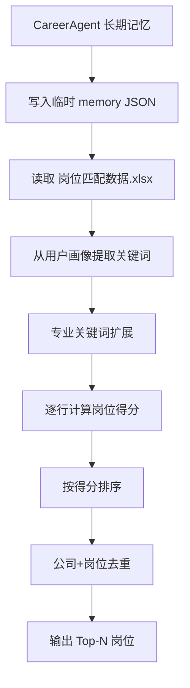
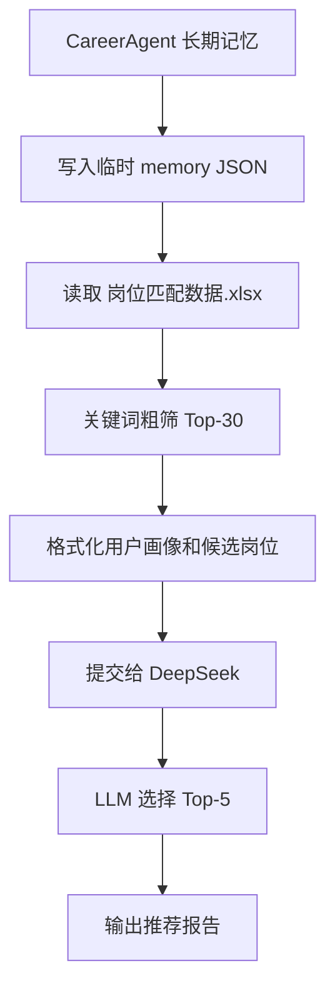
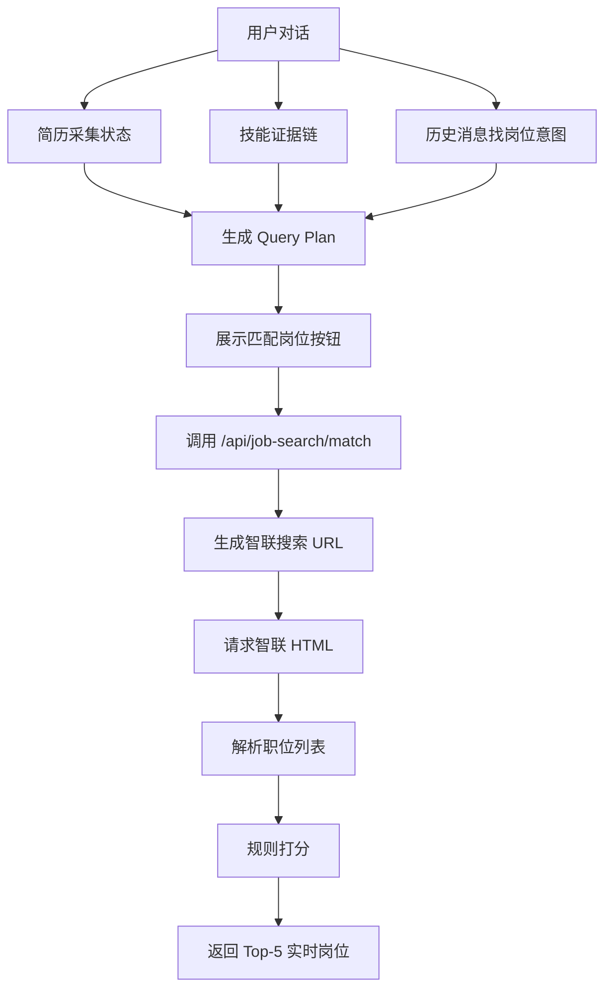
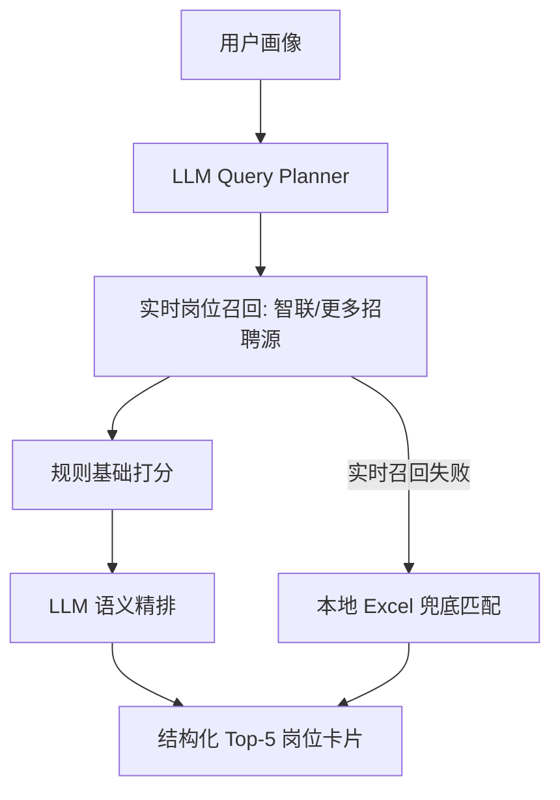

# GUI 与 CLI 岗位匹配算法对比

## 1. 对比对象

本文对比 OpenCareer 中两套岗位匹配实现：

### CLI 项目

CLI 项目中有两种岗位匹配算法：

- `career_matcher.py`：本地关键词加权打分版
- `career_matcher_ai.py`：关键词粗筛 + DeepSeek 精排版

CLI 入口在 `main.py` 中。当用户输入 `match` 命令时，系统会优先尝试 `career_matcher_ai.py`，如果 AI 匹配失败，再回退到 `career_matcher.py`。

### GUI 项目

GUI 项目中的岗位匹配目前由以下文件组成：

- `web/backend/services/job_search_readiness.py`
- `web/backend/services/zhaopin_job_service.py`
- `web/backend/api/routes/job_search.py`
- `web/front/src/components/MessageList.tsx`

GUI 当前逻辑是：在对话中判断用户画像和求职意图是否足够，展示“匹配岗位”按钮；用户点击后，后端实时调用智联招聘搜索页，解析真实岗位，再按规则打分并返回前 5 个岗位。

## 2. 一句话总结

CLI 是“离线岗位库匹配”，GUI 是“实时招聘网站匹配”。

CLI 更像一个本地岗位推荐器：读取 `岗位匹配数据.xlsx`，从已有岗位池里找最匹配的岗位。

GUI 更像一个实时搜索与重排器：根据当前对话画像生成搜索计划，访问智联招聘，拿到实时岗位后再二次排序。

## 3. 总体流程对比

### CLI 本地关键词版



### CLI AI 精排版



### GUI 实时智联版



## 4. 输入数据对比

| 维度 | CLI 关键词版 | CLI AI 版 | GUI 实时版 |
|---|---|---|---|
| 用户画像来源 | `chat_memory.json` 或临时 memory 文件 | 同左 | 数据库会话、简历采集状态、技能证据链、历史消息 |
| 岗位来源 | 本地 `岗位匹配数据.xlsx` | 本地 `岗位匹配数据.xlsx` | 智联招聘搜索页 HTML |
| 是否实时 | 否 | 否 | 是 |
| 是否需要网络 | 不需要 | 需要 DeepSeek API | 需要访问智联招聘 |
| 是否依赖岗位数据文件 | 是 | 是 | 否 |
| 是否依赖用户显式点击 | CLI 输入 `match` | CLI 输入 `match` | AI 气泡展示按钮，用户点击 |

## 5. 用户画像建模差异

### CLI

CLI 匹配器使用的是较简单的长期记忆结构：

```json
{
  "user_info": {},
  "preferences": {},
  "goals": {},
  "important_events": [],
  "emotions": {}
}
```

关键词主要来自三类字段：

- `user_info`
- `preferences`
- `goals`

其中 `user_info` 会触发专业扩展。例如用户信息里出现“计算机”，会扩展出：

```text
计算机、软件、编程、开发、算法、人工智能、数据分析、后端、前端、测试、运维、Java、Python、C++ ...
```

这套方法的优点是简单、稳定、离线可用；缺点是用户画像粒度较粗，不区分“提到过”和“有证据证明”。

### GUI

GUI 使用更细的会话画像：

- 目标岗位
- 城市
- 薪资期望
- 专业
- 学校/年级/教育背景
- 项目经历
- 简历结构化状态
- 技能证据链
- 历史对话中的找岗位意图

其中技能来自 `skill_evidence`，会区分：

- `proven`：已经有经历或证据支撑
- `mentioned`：用户提到过，但证据不足

这让 GUI 在岗位匹配前可以先判断画像是否足够完整，而不是用户一说“匹配岗位”就直接搜。

## 6. 召回方式对比

### CLI：本地岗位库召回

CLI 的召回空间固定为 `岗位匹配数据.xlsx`。

它会对 Excel 中所有岗位逐行打分，然后取分数最高的岗位。

优点：

- 稳定，不受招聘网站反爬和登录影响
- 可以一次性扫 5 万条岗位
- 结果可复现
- 速度主要受本地机器和 Excel 大小影响

缺点：

- 岗位不是实时的
- 数据过期后推荐质量会下降
- 新增岗位必须更新 Excel
- 岗位链接、投递状态、最新薪资等信息不一定可靠

### GUI：实时智联召回

GUI 不读本地岗位 Excel，而是根据 `query_plan` 构造智联招聘搜索 URL。

URL 形态：

```text
https://www.zhaopin.com/sou/jl{城市代码}/kw{关键词编码}/p{页码}
```

关键词会经过智联搜索页使用的特殊编码：

```python
encode_zhaopin_keyword(keyword)
```

然后系统请求 HTML，从页面中的：

```html
<script>__INITIAL_STATE__=...</script>
```

解析出 `positionList`。

优点：

- 岗位实时
- 不需要维护本地 Excel 数据集
- 可以拿到岗位 URL、发布时间、技能标签等线上信息
- 更接近真实投递场景

缺点：

- 依赖智联页面结构
- 可能触发安全验证
- 网络失败时无法返回岗位
- 搜索结果受智联排序和搜索召回影响

## 7. Query 构造差异

### CLI

CLI 没有显式 Query Plan。

它的核心是从用户记忆中抽关键词，然后把关键词和 Excel 各字段做命中匹配。

关键词来源：

- 专业扩展词
- 偏好
- 目标

例如用户说自己是计算机专业、想做后端，关键词集合可能包含：

```text
计算机、软件、编程、开发、后端、Java、Python、数据库、IT、后端开发
```

### GUI

GUI 会先生成明确的 Query Plan：

```json
{
  "role": "Java 后端实习",
  "city": "南京",
  "city_code": "635",
  "salary": "面议",
  "skills": ["Java", "Spring Boot", "MySQL", "Redis"],
  "employment_type": "实习",
  "major": "软件工程",
  "industry": "互联网"
}
```

再由 `build_search_queries(plan)` 生成最多 3 个搜索词：

1. 主搜索词：目标岗位 + 实习/全职
2. 技术语言扩展：例如 `Java 开发 实习`
3. 方向扩展：例如 `Java 后端开发 实习`
4. 技能补充：例如 `Java 后端实习 Spring Boot`

GUI 的 Query 生成更适合实时搜索，因为它要控制搜索词数量，避免请求过多，也要保证召回岗位足够相关。

## 8. 评分算法对比

### CLI 关键词版评分

CLI 关键词版使用字段加权命中：

| 字段 | 权重 | 含义 |
|---|---:|---|
| `knowledge_label` | 3.0 | 理论知识匹配 |
| `technology_label` | 2.5 | 技术栈匹配 |
| `ability_label` | 2.0 | 能力标签匹配 |
| `job_keywords` | 2.0 | 岗位关键词匹配 |
| `industry_label` | 1.5 | 行业方向匹配 |
| `job_position` | 1.0 | 岗位名称匹配 |

每个字段中，只要岗位标签包含用户关键词，就累加对应权重：

```python
score += hits * weight
```

最后筛掉 0 分岗位，取 Top-N。

特点：

- 分数没有固定满分
- 分数大小取决于命中数量和字段权重
- 不扣分
- 不单独处理城市、薪资、发布时间、实习/全职
- 对 Excel 标签质量依赖很强

### CLI AI 版评分

CLI AI 版先复用关键词版做粗筛：

```python
candidates = df[df["_score"] > 0].nlargest(coarse_top_n, "_score")
```

默认取 Top-30 候选。

然后把用户画像和候选岗位格式化给 DeepSeek，让 LLM 按以下维度判断：

1. 专业背景是否匹配岗位知识/技术要求
2. 偏好、目标是否与行业/岗位方向一致
3. 学历、经验是否符合岗位要求
4. 情绪状态和近期事件是否适合岗位节奏
5. 薪资是否合理
6. 城市是否合适

输出是自然语言推荐报告，不是结构化 JSON。

特点：

- 粗筛稳定，精排更像人类职业顾问
- 能解释推荐理由和潜在顾虑
- 可以理解一些非结构化信息
- 但最终排序不可完全复现
- 结果质量依赖 LLM 和 prompt

### GUI 实时版评分

GUI 实时版使用 `score_job(job, plan)` 规则评分，满分截断到 100。

当前主要维度：

| 维度 | 加减分逻辑 |
|---|---|
| 岗位名称 | 完整命中目标岗位最高约 +35，部分方向关键词命中按数量加分 |
| 技能匹配 | 用户技能在岗位标题/描述/标签中命中，最高约 +30 |
| 实习/全职 | 用户找实习时，岗位明确实习 +20；未标注实习约 -18 |
| 城市 | 岗位城市/区域命中目标城市约 +8 |
| 学历 | 学历不限约 +5，其他学历要求小幅加分 |
| 专业 | 用户专业出现在岗位文本中约 +5 |
| 薪资 | 薪资区间有交集约 +7，低于期望约 -5 |
| 发布时间 | 7 天内约 +8，30 天内约 +5，过旧约 -12 |

GUI 会生成：

- `match_score`
- `match_level`
- `match_reasons`
- `concerns`
- `matched_skills`
- `missing_profile_skills`

特点：

- 分数固定在 0-100
- 可解释字段结构化
- 有扣分机制
- 更关注真实投递场景中的城市、实习、发布时间、薪资等因素
- 当前还没有 LLM 精排

## 9. 去重与排序差异

### CLI

CLI 按得分取 Top-N 后，用：

```python
drop_duplicates(subset=["job_position", "company_name"])
```

也就是同一公司同一岗位只保留一条。

排序只看 `_score`。

### GUI

GUI 用岗位 ID 去重：

```python
jobs_by_id.setdefault(job["id"], job)
```

然后过滤无效岗位：

- 没有标题
- 没有公司
- 没有 URL

排序时使用：

```python
(match_score, published_at)
```

也就是先看匹配分，同分时发布时间新的优先。

## 10. 输出形态对比

| 维度 | CLI 关键词版 | CLI AI 版 | GUI 实时版 |
|---|---|---|---|
| 输出类型 | DataFrame / 终端文本 / Excel | 自然语言报告 | JSON + 前端卡片 |
| 默认数量 | Top-10 | Top-5 | Top-5 |
| 是否可下载 | 可导出 Excel | 无结构化导出 | 前端可扩展为收藏/追踪 |
| 是否带岗位 URL | 取决于 Excel 字段 | 取决于候选格式 | 是 |
| 是否带推荐理由 | 不直接带 | 是，LLM 生成 | 是，规则生成 |
| 是否带风险提示 | 否 | 是 | 是 |
| 是否能直接进入投递 | 否 | 否 | 可以通过岗位 URL 或后续浏览器侧边栏扩展 |

## 11. 用户体验差异

### CLI

CLI 是命令式体验。

用户必须输入：

```text
match
```

系统才开始匹配。

如果 AI 可用，输出一段推荐报告；如果 AI 不可用，输出本地关键词匹配结果。

这种方式适合开发者调试和离线分析，但不太适合连续对话中的自然引导。

### GUI

GUI 是对话式体验。

系统会在后台判断：

- 用户是否已经表达找岗位意图
- 目标岗位是否明确
- 背景是否足够
- 技能画像是否足够

满足条件后，AI 气泡里自动展示“匹配岗位”按钮。用户点击后，直接在对话中看到 5 个真实岗位。

这种方式更符合产品化体验：用户不需要记命令，也不需要知道算法什么时候能跑。

## 12. 各自优缺点

### CLI 关键词版

优点：

- 简单、稳定、离线可用
- 不依赖外部招聘网站
- 适合批量处理大规模岗位库
- 可复现，便于调试

缺点：

- 推荐结果取决于本地 Excel 是否新鲜
- 对非结构化用户信息理解弱
- 不处理实时投递因素
- 解释性较弱，只能看到分数

### CLI AI 版

优点：

- 能结合专业、目标、情绪、近期事件等复杂信息
- 推荐理由自然、像职业顾问
- 能输出潜在顾虑和总结建议

缺点：

- 依赖 DeepSeek API
- 输出是自然语言，不利于前端结构化展示
- LLM 排序不完全可复现
- 仍然依赖本地 Excel 岗位库

### GUI 实时版

优点：

- 岗位实时，贴近真实投递场景
- 不需要维护本地岗位 Excel
- 输出结构化，适合前端展示
- 可以解释每个岗位为什么匹配
- 和技能证据链、简历采集、求职进度天然衔接

缺点：

- 依赖智联页面结构和访问稳定性
- 当前没有 LLM 精排，语义理解弱于 CLI AI 版
- 目前只搜索智联，来源单一
- 规则权重还需要真实用户反馈校准

## 13. 核心差异表

| 对比项 | CLI 关键词版 | CLI AI 版 | GUI 实时版 |
|---|---|---|---|
| 算法类型 | 关键词加权 | 关键词粗筛 + LLM 精排 | 实时召回 + 规则重排 |
| 数据源 | 本地 Excel | 本地 Excel | 智联实时搜索页 |
| 用户画像 | 长期记忆关键词 | 长期记忆文本 | 简历状态 + 技能证据链 + 对话意图 |
| 召回规模 | Excel 全量 | Excel 全量粗筛 Top-30 | 智联搜索结果 |
| 排序依据 | 加权命中分 | LLM 综合判断 | 0-100 规则分 |
| 是否扣分 | 否 | 由 LLM 隐式判断 | 是 |
| 是否实时 | 否 | 否 | 是 |
| 是否可解释 | 弱 | 强，但非结构化 | 强，结构化 |
| 是否可复现 | 高 | 中低 | 中高 |
| 对外部依赖 | Excel | Excel + DeepSeek | 智联页面 |
| 产品化程度 | 低 | 中 | 高 |

## 14. 是否应该把 CLI 算法迁移到 GUI

不建议直接整体迁移。

原因：

1. CLI 算法绑定本地 Excel 岗位库，而 GUI 现在的目标是实时岗位。
2. CLI AI 版输出自然语言报告，不适合直接渲染为岗位卡片。
3. GUI 已经有更细的技能证据链和简历状态，直接复用 CLI 的 `chat_memory.json` 关键词抽取会降低画像质量。

但 CLI 中有几部分值得吸收：

### 14.1 专业扩展词

CLI 的 `MAJOR_EXPANSION` 可以迁移到 GUI 的 Query Planner 中。

例如用户是软件工程/计算机专业，但没有明确说 Java，可以扩展出：

- 后端
- 前端
- 测试
- 数据分析
- Java
- Python
- 数据库

这可以提高搜索召回。

### 14.2 LLM 精排思路

CLI AI 版的第二阶段值得迁移，但不应该直接返回自然语言报告。

更好的 GUI 方案是：

1. 智联实时召回 20-30 个岗位
2. 规则算法先打基础分
3. 把用户画像 + 岗位摘要交给 LLM
4. 要求 LLM 返回严格 JSON：

```json
{
  "ranked_jobs": [
    {
      "job_id": "xxx",
      "semantic_score": 86,
      "reason": "项目经历和 Spring Boot 要求匹配",
      "risk": "未看到 Redis 经验要求"
    }
  ]
}
```

5. 最终分 = 规则分 * 0.7 + LLM 语义分 * 0.3

这样可以保留 GUI 的结构化输出，又吸收 CLI AI 的语义判断能力。

### 14.3 本地岗位库作为兜底

智联访问失败时，可以把 CLI 的 Excel 匹配器作为 fallback。

推荐策略：

- 主链路：智联实时搜索
- 兜底链路：本地 Excel 匹配
- 高级链路：实时搜索 + LLM 精排

## 15. 推荐的融合版算法

未来 GUI 岗位匹配可以演进为三层架构：



### 第一层：Query Planner

输入：

- 目标岗位
- 城市
- 学历/年级
- 专业
- 技能证据链
- 行业偏好
- 公司类型偏好

输出：

```json
{
  "queries": ["Java 后端实习", "Spring Boot 实习", "后端开发实习生"],
  "must_have": ["实习", "南京"],
  "nice_to_have": ["Spring Boot", "MySQL"],
  "avoid": ["培训", "销售", "外包"]
}
```

### 第二层：规则基础打分

保留当前 GUI 的规则分：

- 岗位名称
- 技能匹配
- 实习/全职
- 城市
- 学历
- 专业
- 薪资
- 发布时间

### 第三层：LLM 语义精排

吸收 CLI AI 版的优势，让 LLM 判断：

- 项目经历是否真的能支撑岗位要求
- 岗位描述是否隐含培训/销售/外包风险
- 用户当前阶段是否适合该岗位
- 简历需要如何针对岗位调整

但输出必须结构化，不能只给自然语言报告。

## 16. 结论

CLI 算法适合“已有岗位库中的离线推荐”，GUI 算法适合“面向真实投递的实时岗位匹配”。

两者不是谁替代谁，而是侧重点不同：

- CLI 的优势是稳定、可离线、可大规模扫描、AI 版语义判断强
- GUI 的优势是实时、结构化、产品体验好、能和对话/简历/技能证据链联动

当前 GUI 不应该回退成 CLI 的 Excel 匹配模式，但应该吸收 CLI 的两个能力：

1. 专业关键词扩展，提高实时搜索召回率
2. LLM 精排，把规则匹配升级为“规则分 + 语义分”的混合排序

